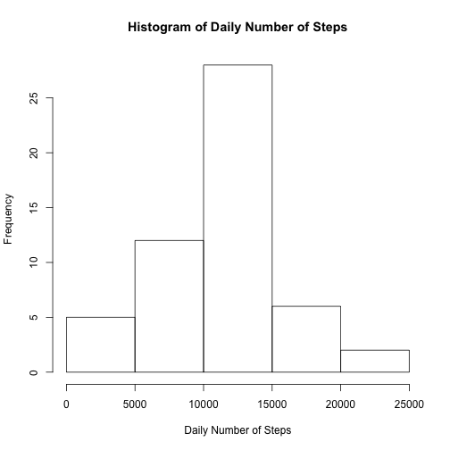
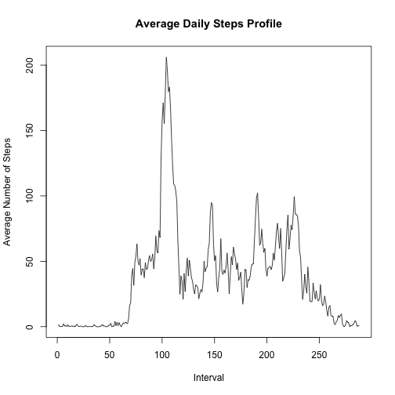
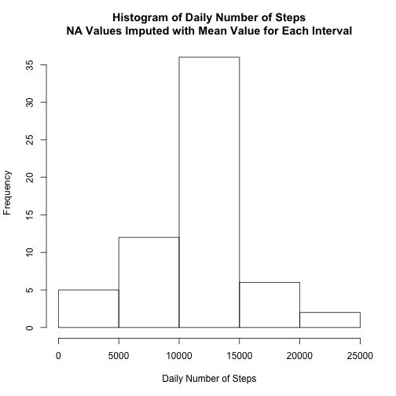
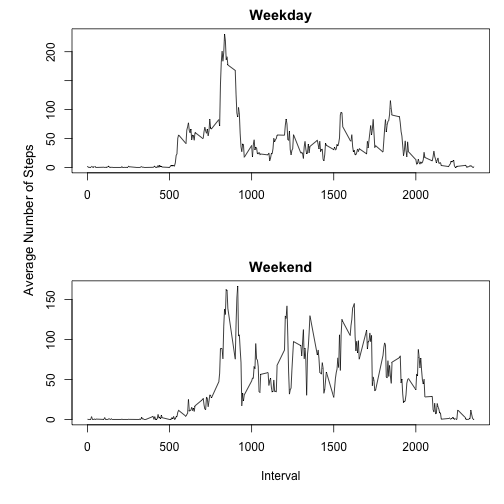

This R markdown file describes analysis performed on activity monitoring data in satisfaction of the requirements for Peer Assessment 1, an assignment for the Reproducible Research course from Johns Hopkins University available at [Coursera.org](http://www.coursera.org).

## Loading and preprocessing the data


```r
raw_data <- read.csv('activity.csv',  colClasses = c("integer","Date","integer"))
numberNA <- nrow(raw_data[raw_data$steps == "NA", ])
data <- na.omit(raw_data)
```

## What is mean total number of steps taken per day?


```r
library(dplyr)
daily <- aggregate(data$steps, by=list(data$date), FUN=sum)$x
hist(daily, xlab="Daily Number of Steps", main="Histogram of Daily Number of Steps")
```

 

```r
dailyMeanSteps <- mean(daily)
dailyMedianSteps <- median(daily)
```

The average daily steps is 1.0766189 &times; 10<sup>4</sup> and the median daily steps is 10765.

## What is the average daily activity pattern?

Plotted below is the average daily profile of steps taken in 5 minute intervals.


```r
avgProfile <- aggregate(data$steps, by=list(data$interval), FUN=mean)
plot(rownames(avgProfile), avgProfile$x, type='l', ylab="Average Number of Steps", xlab="Interval", main="Average Daily Steps Profile")
```

 

```r
intervalMax <- rownames(avgProfile[avgProfile$x == max(avgProfile$x), ])
```

The interval with the maximum number of average steps is 104.

## Inputting missing values

The number of rows with value "NA" in the field "steps" is 2304.

The following code chunk sets "NA" values to the average number of steps for that interval and creates a new dataframe.  First, a new field for the "raw_data" data frame (which includes NA values) is created which stores the mean value of the steps for each interval.  A new data frame is then created based on "raw_data" which fills in NA values in the "steps" field using the mean value at the given interval.


```r
# create new column in raw_data of average value at each interval
raw_data[raw_data$interval == avgProfile$Group.1, "avgStepsInterval"] <- avgProfile[,"x"]

# create new data frame from raw_data (which includes NA's)
dataNAfill <- data.frame(steps=raw_data$steps, date=raw_data$date, interval=raw_data$interval)

# set NA values in new data frame to the average at each interval
dataNAfill[which(is.na(dataNAfill$steps)), "steps"] <- raw_data[which(is.na(raw_data$steps)), "avgStepsInterval"]
```


```r
dailyNAfill <- aggregate(dataNAfill$steps, by=list(dataNAfill$date), FUN=sum)$x
hist(dailyNAfill, xlab="Daily Number of Steps", main="Histogram of Daily Number of Steps\nNA Values Imputed with Mean Value for Each Interval")
```

 

```r
dailyNAfillMeanSteps <- mean(dailyNAfill)
dailyNAfillMedianSteps <- median(dailyNAfill)
```

The average daily steps is 1.0766189 &times; 10<sup>4</sup> and the median daily steps is 1.0766189 &times; 10<sup>4</sup>.  Since I've used the mean for each interval to fill in NA values, the overall mean daily steps has not changed.  The median has shifted slightly.  The estimates for the total number of daily steps has of course increased since I have 


## Are there differences in activity patterns between weekdays and weekends?


```r
# Set all to "weekday" first...
dataNAfill["WeekdayOrWeekend"] = "weekday"
# ...then set Saturdays and Sundays only to "weekend"
dataNAfill[weekdays(dataNAfill$date) %in% c("Sunday","Saturday"), "WeekdayOrWeekend"] = "weekend"
head(dataNAfill)
```

```
##       steps       date interval WeekdayOrWeekend
## 1 1.7169811 2012-10-01        0          weekday
## 2 0.3396226 2012-10-01        5          weekday
## 3 0.1320755 2012-10-01       10          weekday
## 4 0.1509434 2012-10-01       15          weekday
## 5 0.0754717 2012-10-01       20          weekday
## 6 2.0943396 2012-10-01       25          weekday
```


```r
weekdays = dataNAfill[dataNAfill$WeekdayOrWeekend == "weekday",]
weekends = dataNAfill[dataNAfill$WeekdayOrWeekend == "weekend",]

weekdayAvgProfile <- aggregate(weekdays$steps, by=list(weekdays$interval), FUN=mean)
weekendAvgProfile <- aggregate(weekends$steps, by=list(weekends$interval), FUN=mean)

par(mfrow=c(2,1), mai=c(1.1,1,.4,0.2))
plot(weekdayAvgProfile, type='l', xlab='', ylab='', main="Weekday")
plot(weekendAvgProfile, type='l', xlab='Interval', ylab='', main="Weekend")
mtext("Average Number of Steps", side=2, at=250,line=2.5,cex=1.1)
```

 


